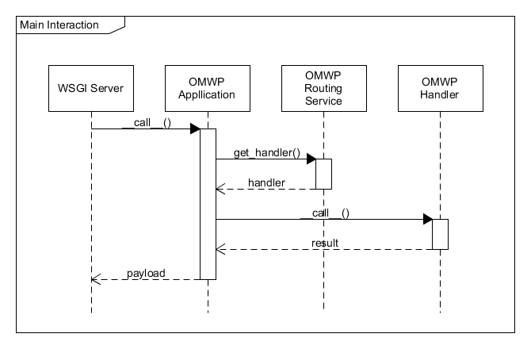
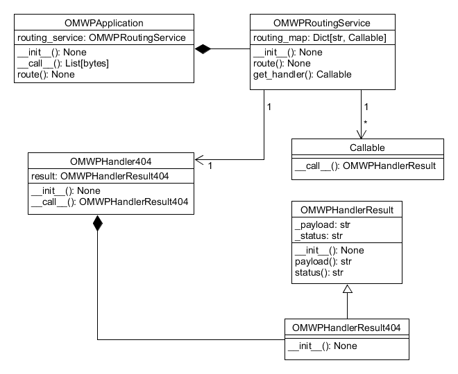

# One More Whiskey Project (OMWP)

Very simple WSGI library with features:
- Routing
- Function-based views

OMWP created for education goals of its author to get more deep understanding of Python web infrastructure.

## Table of contents
1. [Roadmap](#roadmap)
2. [Main interaction](#main-interaction)
3. [Class diagram](#class-diagram)
4. [Example](#example)

## Roadmap 
[Roadmap of implementation OMWP project](docs/ROADMAP.md)

## Main interaction
Main interaction diagram with WSGI Server

## Class diagram

Class diagram

## Example
[Example of application, based on OMWP project](example/README.md)
